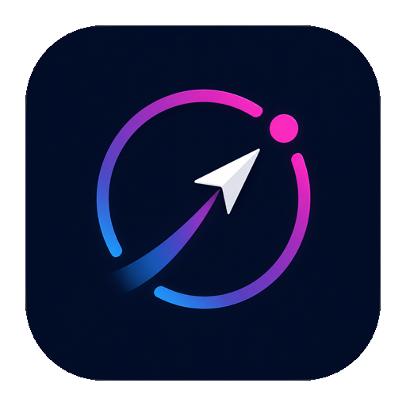
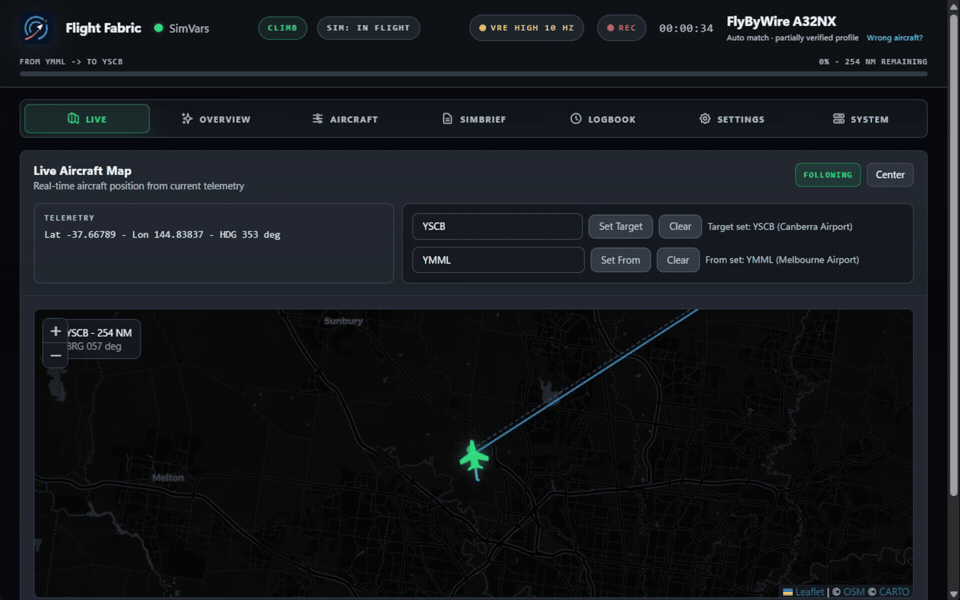

<div align="center">
  
  <h1>Flight Fabric</h1>
  <p><strong>Your second screen and flight recorder for airline flying in Microsoft Flight Simulator 2024.</strong></p>
  <p>See the flight as it happens, then review it when you are back on the ground.</p>
  <p>
    <a href="https://github.com/yenbuilds/flight-fabric/releases/latest"><strong>Download for Windows</strong></a>
    &nbsp;&middot;&nbsp;
    <a href="https://www.flightfabric.com/">Website</a>
    &nbsp;&middot;&nbsp;
    <a href="RELEASE_NOTES.md">What's new</a>
  </p>
</div>



Flight Fabric is built for airline flying in Microsoft Flight Simulator 2024.
It puts useful simulator data on a separate screen, showing your aircraft,
route, and systems in real time. After landing, it turns the recording into an
approach and landing debrief with a full flight timeline.

> [!IMPORTANT]
> Flight Fabric is free, experimental alpha software for consumer flight
> simulators. It is not certified, approved, or intended for real-world aviation.
> Do not rely on it for real-world operations, navigation, training, or safety
> decisions.

## What Flight Fabric does

| While you fly | After you land | On another screen |
| --- | --- | --- |
| Follow position, route progress, speed, altitude, aircraft state, and warnings. | Review approach and touchdown data, replay maps, event timelines, landing trends, and saved history. | Use the Windows app, a spare screen, OBS widgets, or a phone or tablet on your trusted home network. |

## Get flying

1. Download the latest **Windows Setup** installer from
   [GitHub Releases](https://github.com/yenbuilds/flight-fabric/releases/latest).
2. Check the installer SHA-256 value against the checksum published in that
   release's notes.
3. Install Flight Fabric, start MSFS 2024, and open the app.

Windows builds are not currently code signed, so SmartScreen or antivirus
software may show an **Unknown publisher** warning. Only download Flight Fabric
from the official release page. If the checksum does not match, or the file came
from somewhere else, do not run it.

Flight Fabric currently supports the full Windows and SimConnect workflow with
**Microsoft Flight Simulator 2024**. MSFS 2020 is not a tested or supported
target; some features may work through SimConnect, but compatibility is not
guaranteed.

## Put Flight Fabric on another screen

### Phone, tablet, or second computer

Flight Fabric can serve its dashboard to another device on the same trusted
private network as your simulator PC.

1. In Flight Fabric, open **Settings**, then **Network**.
2. Enable **Allow trusted LAN access**.
3. Save the setting and restart Flight Fabric.
4. On the simulator PC, open `http://localhost:8100/setup`.
5. Scan the QR code or use the complete URL shown there.

Treat the paired URL like a temporary password. Its token expires when the
backend restarts. LAN traffic is not encrypted, so use this feature only on a
private network you trust.

### OBS overlays

Add an OBS **Browser Source**, leave **Local file** unchecked, and point it at
one of Flight Fabric's local widgets:

```text
http://localhost:8100/widgets-compact/widget-top.html
http://localhost:8100/widgets-compact/widget-bottom.html
```

## Build from source

This section is for contributors and anyone who prefers to build Flight Fabric
themselves. Most users can use the installer above.

<details>
<summary><strong>Requirements and setup</strong></summary>

### Requirements

- Node.js 22.12 or newer
- npm
- Windows for the full Electron and MSFS workflow
- Microsoft Flight Simulator 2024
- Microsoft Flight Simulator 2024 SDK for `SimConnect.dll`
- Rust with `cargo` on `PATH`
- Visual Studio Build Tools 2022 or newer with the **Desktop development with
  C++** workload, or another MSVC toolchain that provides `link.exe`

Confirm Rust and the Microsoft linker are available:

```powershell
cargo --version
Get-Command link.exe
```

Install the project dependencies:

```powershell
npm install
npm --prefix backend install
npm run frontend:install
npm run electron:install
```

Fetch the required local airport and runway data before launching the backend
directly with `start-simbridge.bat` or running the complete test suite:

```powershell
npm run data:sync:required
```

</details>

<details>
<summary><strong>Provide SimConnect.dll</strong></summary>

`SimConnect.dll` is not included in the public source mirror because its
redistribution terms are currently uncertain. It remains Microsoft's
proprietary runtime and is not licensed under Flight Fabric's AGPL.

1. In Microsoft Flight Simulator 2024, enable **Developer Mode** under General
   options.
2. From the Developer Mode toolbar, choose **Help**, then **SDK Installer**, and install
   the SDK. See Microsoft's
   [SDK installation guide](https://docs.flightsimulator.com/msfs2024/html/1_Introduction/SDK_Overview.htm).
3. Locate the DLL, normally at:

   ```text
   C:\MSFS 2024 SDK\SimConnect SDK\lib\SimConnect.dll
   ```

The build detects that location automatically. For a custom SDK location,
either copy the DLL to:

```text
backend\telemetry-provider\simconnect\SimConnect.dll
```

or set `FF_SIMCONNECT_DLL_PATH` before building:

```powershell
$env:FF_SIMCONNECT_DLL_PATH = 'D:\path\to\SimConnect.dll'
npm run build
```

An existing DLL at the repository path takes priority. Otherwise, the build
checks `FF_SIMCONNECT_DLL_PATH` and then installed SDK locations. It logs the
selected source and SHA-256 checksum.

Do not commit the DLL to a public fork. Review the
[Microsoft Flight Simulator SDK licence](https://docs.flightsimulator.com/msfs2024/html/1_Introduction/SDK_EULA.htm)
that applies to your installation.

</details>

<details>
<summary><strong>Run and package the app</strong></summary>

Run the Electron app from source:

```powershell
npm run electron
```

Build the packaged Windows app:

```powershell
npm run build
```

Packaged output is written to `dist/electron`.

</details>

## License and Corresponding Source

Flight Fabric is free software licensed under the
[GNU Affero General Public License version 3](LICENSE.md),
`AGPL-3.0-only`. Complete corresponding source for each released version is
available from the [Flight Fabric releases page](https://github.com/yenbuilds/flight-fabric/releases).

Notices, source links, and licence terms for third party components are in
[THIRD_PARTY_NOTICES.md](THIRD_PARTY_NOTICES.md).

## More information

- [Release notes](RELEASE_NOTES.md)
- [Safety notice](SAFETY-NOTICE.md)
- [How Flight Fabric uses AI](AI_POLICY.md)
- [Security policy](SECURITY.md)
