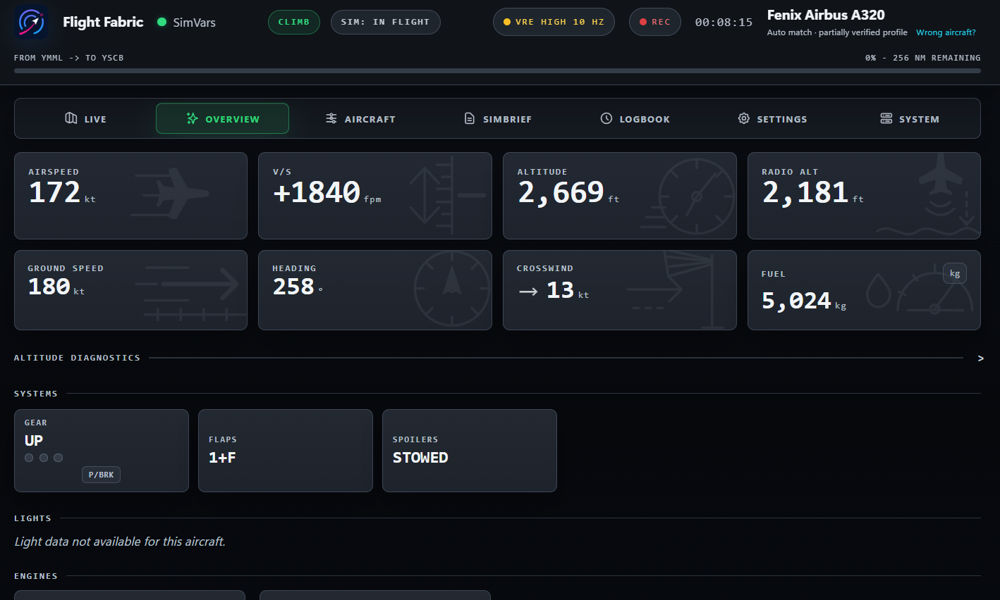
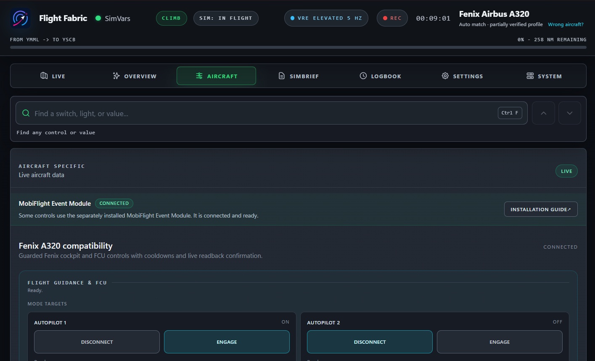
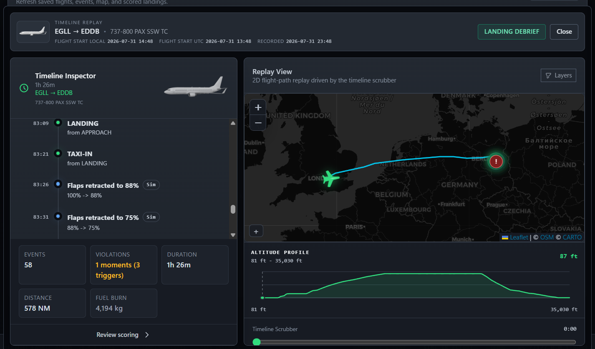
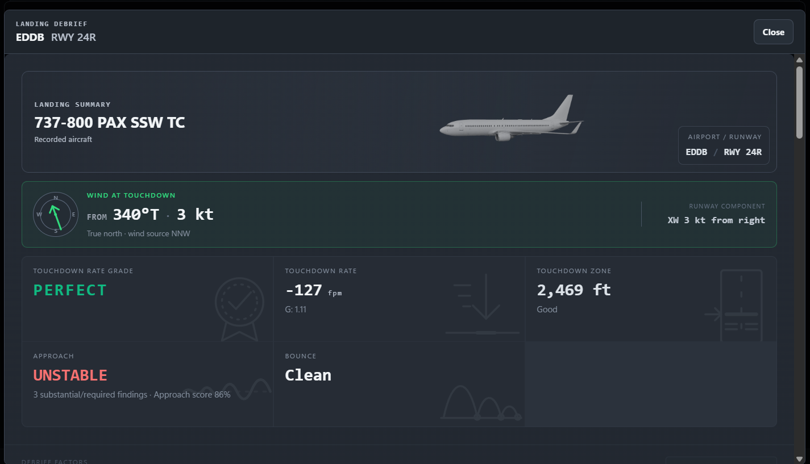

<div align="center">
  
  <h1>Flight Fabric</h1>
  <p><strong>Live flight data, selected aircraft controls, and landing debriefs.</strong></p>
  <p>A second-screen companion and recorder for Microsoft Flight Simulator 2024.</p>
  <p>
    <a href="https://github.com/yenbuilds/flight-fabric/releases/latest"><strong>Download for Windows</strong></a>
    &nbsp;&middot;&nbsp;
    <a href="https://www.flightfabric.com/">Website</a>
    &nbsp;&middot;&nbsp;
    <a href="RELEASE_NOTES.md">What's new</a>
  </p>
</div>


Flight Fabric keeps your aircraft, route, systems, and selected controls on a
separate screen. After landing, it provides an approach and landing debrief,
with a replayable flight timeline.

> [!IMPORTANT]
> Flight Fabric is free, experimental alpha software for consumer flight
> simulators. It is not certified, approved, or intended for real-world aviation.
> Do not rely on it for real-world operations, navigation, training, or safety
> decisions.

## See it in action

| Live overview | Aircraft controls |
| --- | --- |
|  |  |
| **Timeline replay** | **Landing debrief** |
|  |  |

## What Flight Fabric does

| Fly and control | After you land | On another screen |
| --- | --- | --- |
| Follow position, route progress, speed, altitude, aircraft state, and warnings. Use searchable controls and local, offline push-to-talk voice commands where supported. | Review approach and touchdown data, maps, event timelines, landing trends, and saved history. | Use the Windows app, another display, OBS widgets, or a phone or tablet on your trusted home network. |

## Get flying

1. Download the latest **Windows Setup** installer from
   [GitHub Releases](https://github.com/yenbuilds/flight-fabric/releases/latest).
2. Check the installer SHA-256 value against the checksum published in that
   release's notes.
3. Install Flight Fabric, start MSFS 2024, and open the app.

Voice control is off by default. Open **Aircraft** > **Voice control**, enable
it, then set a global shortcut in **Voice settings** or use the on-screen
hold-to-talk button. While it is off, Flight Fabric does not start voice
recognition, the push-to-talk helper, or microphone discovery.

During a push-to-talk session, microphone audio is processed locally in memory.
It is never saved, logged, or sent over the network. **Refresh microphones**
briefly opens and closes the default input only to list device names; it does
not read, process, save, or send audio. Windows SAPI can read command results
aloud without a browser or network text-to-speech service, and a new
push-to-talk session stops the current readback.

Aircraft-specific voice catalogues cover FlyByWire A32NX, PMDG 737,
PMDG 777-300ER/200ER/200LR/F, and Fenix A319/A320/A321 families. The A32NX
catalogue is a guarded beta slice for FCU speed/Mach, heading, altitude,
vertical speed/FPA and managed/selected modes, AP1/AP2, captain flight director,
autothrust, LOC/APPR/EXPED, forward throttle detents, standard gear and flap
steps, parking brake, spoiler arming, selected exterior lights, and takeoff lights.
FCU targets use only FlyByWire's documented fixed custom client events through
SimConnect, with mode guards and newer logical readback required after dispatch.
Other profiles expose only standard commands confirmed by their active guarded
catalogue.

## Premium aircraft support

These premium add-on aircraft include both the extended aircraft-specific controls
page and aircraft-specific voice commands. Controls and commands are shown only
when they are supported by the active aircraft profile.

| Aircraft family | Extended aircraft-specific controls | Aircraft-specific voice commands |
| --- | :---: | :---: |
| Fenix Airbus A319, A320, A321 | Yes | Yes |
| PMDG Boeing 737-600, 737-700, 737-800, 737-900 | Yes | Yes |
| PMDG Boeing 777-300ER, 777-200ER, 777-200LR, 777F | Yes | Yes |

Windows builds are currently unsigned, so SmartScreen or antivirus may show an
**Unknown publisher** warning. Download only from the official release page and
do not run a file with a mismatched checksum or an unknown source.

The supported Windows and SimConnect target is **Microsoft Flight Simulator
2024**. MSFS 2020 is untested and unsupported; any compatibility is incidental.

## Put Flight Fabric on another screen

### Phone, tablet, or second computer

You can open the dashboard on another device on the same trusted private
network as the simulator PC.

1. In Flight Fabric, open **Settings**, then **Network**.
2. Enable **Allow trusted LAN access**.
3. Save the setting and restart Flight Fabric.
4. On the simulator PC, open `http://localhost:8100/setup`.
5. Scan the QR code or use the complete URL shown there.

Treat the paired URL as a temporary password. Its token expires when the backend
restarts. LAN traffic is unencrypted, so use this only on a private network.

### OBS overlays

Add an OBS **Browser Source**, leave **Local file** unchecked, and point it at
one of Flight Fabric's local widgets:

```text
http://localhost:8100/widgets-compact/widget-top.html
http://localhost:8100/widgets-compact/widget-bottom.html
```

## Build from source

Use these instructions only when building from source. Most users should use the
installer above.

<details>
<summary><strong>Requirements and setup</strong></summary>

### Requirements

- Node.js 22.12 or newer
- npm
- Windows for the full Electron and MSFS workflow
- Microsoft Flight Simulator 2024
- Microsoft Flight Simulator 2024 SDK for `SimConnect.dll`
- Rust with `cargo` on `PATH`
- Visual Studio Build Tools 2022 or newer with the **Desktop development with
  C++** workload, or another MSVC toolchain that provides `link.exe`

Confirm Rust and the Microsoft linker are available:

```powershell
cargo --version
Get-Command link.exe
```

Install the project dependencies:

```powershell
npm install
npm --prefix backend install
npm run frontend:install
npm run electron:install
```

Fetch the required local airport and runway data before launching the backend
directly with `start-simbridge.bat` or running the complete test suite:

```powershell
npm run data:sync:required
```

</details>

<details>
<summary><strong>Provide SimConnect.dll</strong></summary>

`SimConnect.dll` is not included in the public source mirror. It is Microsoft's
proprietary runtime, and its redistribution terms are uncertain; the Flight
Fabric AGPL does not cover it.

1. In Microsoft Flight Simulator 2024, enable **Developer Mode** under General
   options.
2. From the Developer Mode toolbar, choose **Help**, then **SDK Installer**, and install
   the SDK. See Microsoft's
   [SDK installation guide](https://docs.flightsimulator.com/msfs2024/html/1_Introduction/SDK_Overview.htm).
3. Locate the DLL, normally at:

   ```text
   C:\MSFS 2024 SDK\SimConnect SDK\lib\SimConnect.dll
   ```

The build detects that location automatically. For a custom SDK location, copy
the DLL to:

```text
backend\telemetry-provider\simconnect\SimConnect.dll
```

or set `FF_SIMCONNECT_DLL_PATH` before building:

```powershell
$env:FF_SIMCONNECT_DLL_PATH = 'D:\path\to\SimConnect.dll'
npm run build
```

The repository DLL takes priority; otherwise the build checks
`FF_SIMCONNECT_DLL_PATH`, then installed SDK locations. It logs the selected
source and SHA-256 checksum.

Do not commit the DLL to a public fork. Review the
[Microsoft Flight Simulator SDK licence](https://docs.flightsimulator.com/msfs2024/html/1_Introduction/SDK_EULA.htm)
that applies to your installation.

</details>

<details>
<summary><strong>Provide the offline voice model</strong></summary>

Offline voice recognition uses the Apache-2.0
`sherpa-onnx-streaming-zipformer-en-2023-06-26` model. Its weights are build
inputs, pinned to an immutable upstream revision, and are not stored in Git.

The first `npm run electron` or `npm run build` downloads the roughly 70 MiB
runtime subset from a pinned upstream revision, checks every file against the
sizes and SHA-256 values in `electron/voice-model-manifest.js`, then caches it
under `electron/resources/models/`. Later builds reuse the verified cache.
Packaged apps include that model and never download it at runtime.

For an offline build, download and extract Sherpa's
[`sherpa-onnx-streaming-zipformer-en-2023-06-26` archive](https://github.com/k2-fsa/sherpa-onnx/releases/download/asr-models/sherpa-onnx-streaming-zipformer-en-2023-06-26.tar.bz2),
then point `FF_VOICE_MODEL_DIR` at the extracted directory:

```powershell
$env:FF_VOICE_MODEL_DIR = 'D:\models\sherpa-onnx-streaming-zipformer-en-2023-06-26'
npm --prefix electron run provision:voice-model
```

The repository supplies the BPE vocabulary for aviation hotwords, so
`FF_VOICE_MODEL_DIR` needs only the upstream encoder, decoder, joiner, and
`tokens.txt` files. Provisioning fails if any required file differs from the
pinned contents.

</details>

<details>
<summary><strong>Run and package the app</strong></summary>

Run the Electron app from source:

```powershell
npm run electron
```

Build the packaged Windows app:

```powershell
npm run build
```

Packaged output is written to `dist/electron`.

</details>

## License and Corresponding Source

Flight Fabric is free software, licensed under the
[GNU Affero General Public License version 3](LICENSE.md),
`AGPL-3.0-only`. Complete corresponding source for each released version is
available from the [Flight Fabric releases page](https://github.com/yenbuilds/flight-fabric/releases).

Notices, source links, and licence terms for third party components are in
[THIRD_PARTY_NOTICES.md](THIRD_PARTY_NOTICES.md).

## More information

- [Release notes](RELEASE_NOTES.md)
- [Safety notice](SAFETY-NOTICE.md)
- [How Flight Fabric uses AI](AI_POLICY.md)
- [Security policy](SECURITY.md)
