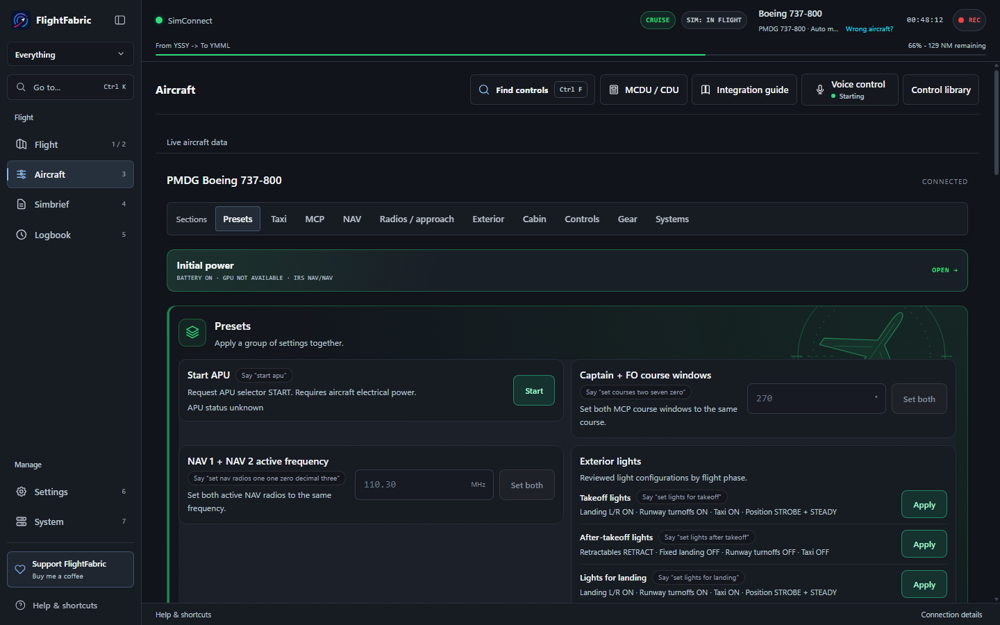
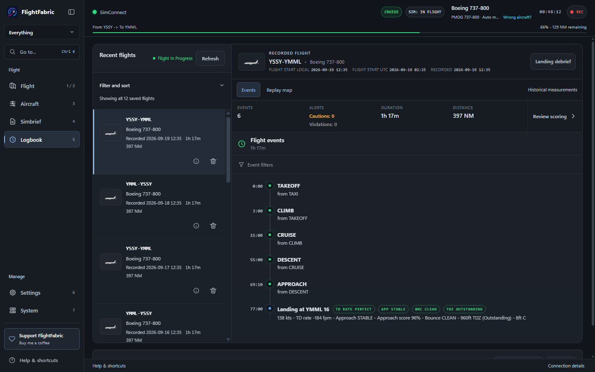
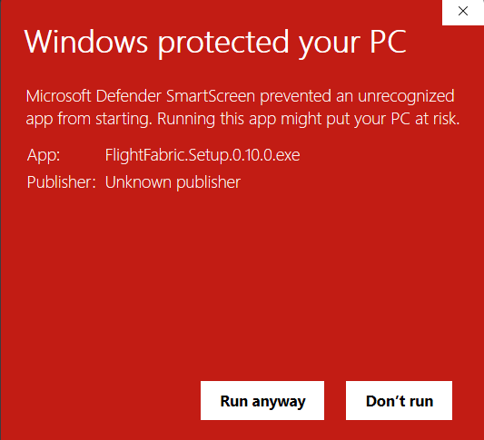

<div align="center">
  
  <h1>FlightFabric for MSFS 2024</h1>
  <p><strong>Control your airliner by voice or from another screen.</strong></p>
  <p>Live flight data, automatic recording, and landing reviews for Microsoft Flight Simulator 2024.</p>
  <p>
    <a href="https://www.flightfabric.com/download/windows/"><strong>Download for Windows (.exe)</strong></a>
    &nbsp;&middot;&nbsp;
    <a href="https://www.flightfabric.com/">Website</a>
    &nbsp;&middot;&nbsp;
    <a href="RELEASE_NOTES.md">What's new</a>
  </p>
  <p><strong><span data-release-channel>Public alpha</span></strong> · v<span data-release-version>0.11.0</span> · Windows 64-bit · Free</p>
  <p data-release-note>Still in development. Expect bugs and incomplete aircraft support.</p>
</div>


FlightFabric puts supported aircraft controls where you can reach them. Use
voice control, open the same controls on a phone or tablet, or keep them beside
the simulator on your PC. While you fly, FlightFabric follows the aircraft and
records the flight. After landing, it shows what happened during the approach,
touchdown, and rollout.

> [!IMPORTANT]
> FlightFabric is free, experimental alpha software for consumer flight
> simulators. It is not certified, approved, or intended for real-world aviation.
> Do not rely on it for real-world operations, navigation, training, or safety
> decisions.

## See it in action

| Live overview | Aircraft controls |
| --- | --- |
|  |  |
| **Logbook and timeline** | **Landing debrief** |
|  |  |

## One app for the whole flight

| Control the aircraft | Follow the flight | Review what happened |
| --- | --- | --- |
| Use voice or searchable controls made for each supported aircraft. Open the controls on your PC, phone, tablet, or another computer. | See position, route progress, speed, altitude, aircraft state, warnings, and your SimBrief plan as you fly. | Replay the timeline and flight path, then review approach stability, touchdown, centreline tracking, rollout, trends, and saved history. |

## Get flying

1. [Download FlightFabric for Windows](https://www.flightfabric.com/download/windows/).
2. Open the downloaded installer and follow the setup steps.
3. Start MSFS 2024 and open FlightFabric.

The download is the complete Windows 64-bit installer. You do not need the
**Source code** archives on GitHub.

### Expect a Windows warning

The alpha installer is not code signed yet, so Windows cannot verify its
publisher. The first time you open it, SmartScreen shows a red **Windows
protected your PC** screen. That is normal for a small unsigned app and is not
a virus report.

1. Select **More info**. The screen then shows the app name and an **Unknown
   publisher** line, as in the picture below.
2. Check that the app is `FlightFabric.Setup.<version>.exe` and that you
   downloaded it from the official link above, then select **Run anyway**.



If there is no **Run anyway** option, or Windows reports a virus or other
threat, stop and [report the exact warning](https://github.com/yenbuilds/flight-fabric/issues).
Do not turn off antivirus, SmartScreen or Smart App Control to install
FlightFabric. On a managed PC, ask your administrator.

<details>
<summary><strong>Optional: verify the downloaded file</strong></summary>

If you want to verify your download, you can compare its SHA-256 checksum with
the value GitHub shows beside the installer on the
<a data-release-notes href="https://github.com/yenbuilds/flight-fabric/releases/tag/v0.11.0">release page</a>.
This is optional and is not required to install the app.

</details>

Voice control is off until you enable it. Open **Aircraft** > **Voice control**,
then set a keyboard shortcut in **Voice settings**, or use
the talk button on screen.
When voice control is off, FlightFabric does not listen for commands or check
for microphones.

When you hold the talk button, your microphone audio is processed in memory on
your PC. After release, the microphone remains active briefly to preserve the
end of your speech, then closes after buffered audio is flushed. Audio is not
saved, logged, or sent over the network. FlightFabric can also read command
results aloud using a voice already installed in Windows.

Voice commands are available for FlyByWire A32NX, iniBuilds A350-900 and
A350-1000, PMDG 737, PMDG 777, and Fenix A319, A320, and A321 aircraft. Depending
on the aircraft, you can set flight guidance values and modes, operate common
surfaces and lights, and use useful presets. FlightFabric checks which aircraft
is loaded and shows the commands that work with it.

## Aircraft support

These aircraft have their own detailed controls and voice commands:

| Aircraft family | Detailed controls | Voice commands |
| --- | :---: | :---: |
| FlyByWire Airbus A32NX | Yes | Yes |
| Fenix Airbus A319, A320, A321 | Yes | Yes |
| iniBuilds Airbus A350-900, A350-1000 | Yes | Yes |
| PMDG Boeing 737-600, 737-700, 737-800, 737-900 | Yes | Yes |
| PMDG Boeing 777-300ER, 777-200ER, 777-200LR, 777F | Yes | Yes |

The A32NX integration uses FlyByWire's documented events for flight guidance
values and checks the result against fresh aircraft data.

The supported Windows and SimConnect target is **Microsoft Flight Simulator
2024**. MSFS 2020 is untested and unsupported; any compatibility is incidental.

## Put FlightFabric on another screen

### Phone, tablet, or second computer

You can open the dashboard on another device on the same trusted private
network as the simulator PC.

1. In FlightFabric, open **Settings**.
2. In **Phone & tablet access**, enable **Use FlightFabric on phones and
   tablets** on your private home network.
3. Aircraft controls are enabled by default for paired devices; turn them off
   there if you only want a read-only second screen.
4. Save the settings and restart FlightFabric.
5. On the simulator PC, choose **Phone setup** in the header.
6. Scan the private QR code, or type the short address shown there.

No camera? Type the short **No camera?** address shown in Phone setup on the
device. It opens a read-only dashboard. Choose **Request aircraft controls**
there, then approve the matching six-digit code on the simulator PC.

The page keeps the phone's screen awake after your first tap, for as long as
it stays open in front, so it works as a second screen for the whole flight.

Treat the QR code as a temporary password. Its token expires when the backend
restarts. The typed address contains no pairing credential and requires approval
of a matching code on the simulator PC. LAN traffic is unencrypted, so use this
only on a private network.

### Inside MSFS 2024

Open **Settings > MSFS 2024 toolbar panel** and choose **Install** for your
MSFS 2024 installation (close the simulator first, then restart it). A
**FlightFabric** button appears in the in-flight toolbar with your SimBrief
plan, the voice commands and questions for the current aircraft, live
push-to-talk status, your last landing and the flight phase. The panel is
read-only and talks only to FlightFabric on the same PC. Use the same
settings section to update or remove it, and reinstall if you change the
FlightFabric network ports.

### OBS overlays

Add an OBS **Browser Source**, leave **Local file** unchecked, and point it at
one of FlightFabric's local widgets:

```text
http://localhost:8100/widgets-compact/widget-top.html
http://localhost:8100/widgets-compact/widget-bottom.html
```

## Build from source

Use these instructions only when building from source. Most users should use the
installer above.

<details>
<summary><strong>Requirements and setup</strong></summary>

### Requirements

- Node.js 22.12 or newer
- npm
- Windows for the full Electron and MSFS workflow
- Microsoft Flight Simulator 2024
- Microsoft Flight Simulator 2024 SDK for `SimConnect.dll`
- Rust with `cargo` on `PATH`
- Visual Studio Build Tools 2022 or newer with the **Desktop development with
  C++** workload, or another MSVC toolchain that provides `link.exe`

Confirm Rust and the Microsoft linker are available:

```powershell
cargo --version
Get-Command link.exe
```

Install the project dependencies:

```powershell
npm install
npm --prefix backend install
npm run frontend:install
npm run electron:install
```

Fetch the required local airport and runway data before launching the backend
directly with `start-simbridge.bat` or running the complete test suite:

```powershell
npm run data:sync:required
```

Run the dead-code audit after changing entry points, imports, exports, or
dependencies:

```powershell
npm run dead-code
```

Knip's runtime-loaded entry points are documented in `knip.json`. Review its
findings before removing code; the audit does not delete files automatically.
Browser test fixtures are served as HTML script entry points, with `vue` and
`pinia` resolved from the frontend installation by the test Vite aliases. Root
`ajv`, `ajv-formats`, and `dotenv` dependencies support the compiled backend in
`dist/`, so they are retained even though their source imports live in `backend/`.

</details>

<details>
<summary><strong>Provide SimConnect.dll</strong></summary>

`SimConnect.dll` is not included in the public source mirror. It is Microsoft's
proprietary runtime, and its redistribution terms are uncertain; the Flight
Fabric AGPL does not cover it.

1. In Microsoft Flight Simulator 2024, enable **Developer Mode** under General
   options.
2. From the Developer Mode toolbar, choose **Help**, then **SDK Installer**, and install
   the SDK. See Microsoft's
   [SDK installation guide](https://docs.flightsimulator.com/msfs2024/html/1_Introduction/SDK_Overview.htm).
3. Locate the DLL, normally at:

   ```text
   C:\MSFS 2024 SDK\SimConnect SDK\lib\SimConnect.dll
   ```

The build detects that location automatically. For a custom SDK location, copy
the DLL to:

```text
backend\telemetry-provider\simconnect\SimConnect.dll
```

or set `FF_SIMCONNECT_DLL_PATH` before building:

```powershell
$env:FF_MSFS2024_SDK_ROOT = 'D:\MSFS 2024 SDK'
$env:FF_SIMCONNECT_DLL_PATH = Join-Path $env:FF_MSFS2024_SDK_ROOT 'SimConnect SDK\lib\SimConnect.dll'
npm run build
```

The repository DLL takes priority, followed by the compiled backend copy,
`FF_SIMCONNECT_DLL_PATH`, then installed SDK locations. Windows packaging
requires the DLL from the latest **retail** MSFS 2024 SDK and access to
Microsoft's SDK release feed. The reviewed version and SHA-256 checksum in
`scripts/simconnect-runtime.json` identify the DLL extracted from Microsoft's
official SDK archive. The selected, staged and packaged DLLs must match that
record. Preview SDKs are excluded. A stale repository or compiled copy fails
the build even when a newer fallback is available.

For a custom SDK installation, set `FF_MSFS2024_SDK_ROOT` to its root directory
(containing `version.txt` and `SimConnect SDK`). An SDK installation is optional
when the DLL matches the current provenance record. Without that record, the
guard checks the installed SDK's version and DLL instead. A stale or invalid
record must be refreshed after verifying the new official archive; it cannot
be bypassed by a fallback. Run `npm run release:simconnect:check` for
the read-only online check before building; `npm run test:simconnect-sdk` runs
the offline regression tests without requiring an installed SDK.

Do not commit the DLL to a public fork. Review the
[Microsoft Flight Simulator SDK licence](https://docs.flightsimulator.com/msfs2024/html/1_Introduction/SDK_EULA.htm)
that applies to your installation.

</details>

<details>
<summary><strong>Provide the offline voice model</strong></summary>

Offline voice recognition uses the Apache-2.0
`sherpa-onnx-streaming-zipformer-en-2023-06-21` English LibriSpeech + GigaSpeech
model. Its weights are build
inputs, pinned to an immutable upstream revision, and are not stored in Git.

The first `npm run electron` or `npm run build` downloads the roughly 181 MiB
runtime subset from a pinned upstream revision, checks every file against the
sizes and SHA-256 values in `electron/voice-model-manifest.js`, then caches it
under `electron/resources/models/`. Later builds reuse the verified cache.
Packaged apps include that model and never download it at runtime.

For an offline build, download and extract Sherpa's
[`sherpa-onnx-streaming-zipformer-en-2023-06-21` archive](https://github.com/k2-fsa/sherpa-onnx/releases/download/asr-models/sherpa-onnx-streaming-zipformer-en-2023-06-21.tar.bz2),
then point `FF_VOICE_MODEL_DIR` at the extracted directory:

```powershell
$env:FF_VOICE_MODEL_DIR = 'D:\models\sherpa-onnx-streaming-zipformer-en-2023-06-21'
npm --prefix electron run provision:voice-model
```

The repository supplies the BPE vocabulary for aviation hotwords, so
`FF_VOICE_MODEL_DIR` needs only the upstream encoder, decoder, joiner, and
`tokens.txt` files. Provisioning fails if any required file differs from the
pinned contents.

</details>

<details>
<summary><strong>Run and package the app</strong></summary>

Run the Electron app from source:

```powershell
npm run electron
```

Build the packaged Windows app:

```powershell
npm run build
```

Packaged output is written to `dist/electron`.

</details>

<details>
<summary><strong>Develop aircraft support</strong></summary>

Its interface, API, and command-line operations are unavailable. Existing saved
sessions are preserved. The implementation is retained for a later review.

</details>

## License and Corresponding Source

FlightFabric is free software, licensed under the
[GNU Affero General Public License version 3](LICENSE.md),
`AGPL-3.0-only`. Complete corresponding source for each released version is
available from the [FlightFabric releases page](https://github.com/yenbuilds/flight-fabric/releases).

Notices, source links, and licence terms for third party components are in
[THIRD_PARTY_NOTICES.md](THIRD_PARTY_NOTICES.md).

## More information

- [Release notes](RELEASE_NOTES.md)
- [Safety notice](SAFETY-NOTICE.md)
- [How FlightFabric uses AI](AI_POLICY.md)
- [Security policy](SECURITY.md)
